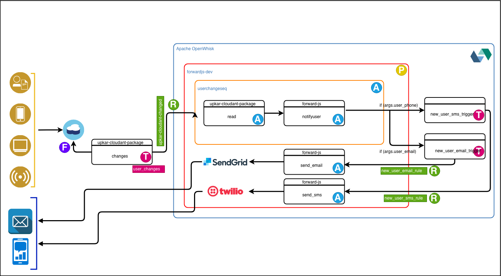

# Sample Application built with OpenWhisk

## OpenWhisk
Apache OpenWhisk (Incubating) is an open source, distributed Serverless platform that executes functions (fx) in response to events at any scale. OpenWhisk manages the infrastructure, servers and scaling using Docker containers so you can focus on building amazing and efficient applications.
## Application Architecture

## Application Demo

## Included Components

- [IBMCloud](https://www.ibm.com/cloud/) - The application is hosted on IBMCloud
- [IBM Cloudant](https://www.ibm.com/cloud/cloudant) - A scalable JSON document database for web, mobile, IoT and serverless applications
- [IBM Cloud Functions](https://www.ibm.com/cloud/functions) - Based on Apache OpenWhisk, IBM Cloud Functions is a polyglot functions-as-a-service (FaaS) programming platform for developing lightweight code that scalably executes on demand.
- [SendGrid](https://sendgrid.com/) - an industry-disrupting, cloud-based email service to solve the challenges of reliably delivering emails on behalf of growing companies. 
- [Twilio](https://www.twilio.com/) - Enables phones, VoIP, and messaging to be embedded into web, desktop, and mobile software.