# OpenWhisk Sample Registration Application - JavaScript

## Steps

Clone [this repository](https://github.com/lidderupk/openwhisk-registration) and cd into the base directory.
## 1. IBMCloud CLI
1.1 Set up IBM CLI and log in as per [directions here](https://console.bluemix.net/docs/cli/index.html#overview).

1.2 Log into IBMCloud by using the following command
```
ic login
API endpoint: https://api.ng.bluemix.net

Email> <email that you signed up with IBMCloud with>

Password>
Authenticating...
OK
```
1.3 Next, set the cloudfoundary as the target
```
ic target --cf
Targeted Cloud Foundry (https://api.ng.bluemix.net)
```

1.4 Ensure you have the functions plugin installed by typing `ic fn`. ic is short for ibmcloud. You should see the default help.

```
IBM Cloud CLI plug-in for IBM Cloud Functions
Usage:
  wsk [command]

Available Commands:
  action      work with actions
  activation  work with activations
  package     work with packages
  rule        work with rules
  trigger     work with triggers
  sdk         work with the sdk
  property    work with whisk properties
  list        list entities in the current namespace
  api         work with APIs
  service     Bind and unbind service credentials to an action or package.
  namespace   Work with IAM-based and Cloud Foundry-based namespaces.


Flags:
      --apihost HOST         whisk API HOST
      --apiversion VERSION   whisk API VERSION
  -u, --auth KEY             authorization KEY
      --cert string          client cert
  -d, --debug                debug level output
  -h, --help                 help for wsk
  -i, --insecure             bypass certificate checking
      --key string           client key
  -v, --verbose              verbose output

Use "wsk [command] --help" for more information about a command.
```
## 2. Create Cloudant Service

2.1 You can go to the catalog and create a Cloudant service. Pick the LITE plan.

2.1.1 Look for `Cloudant` in the IBMCloud catalog

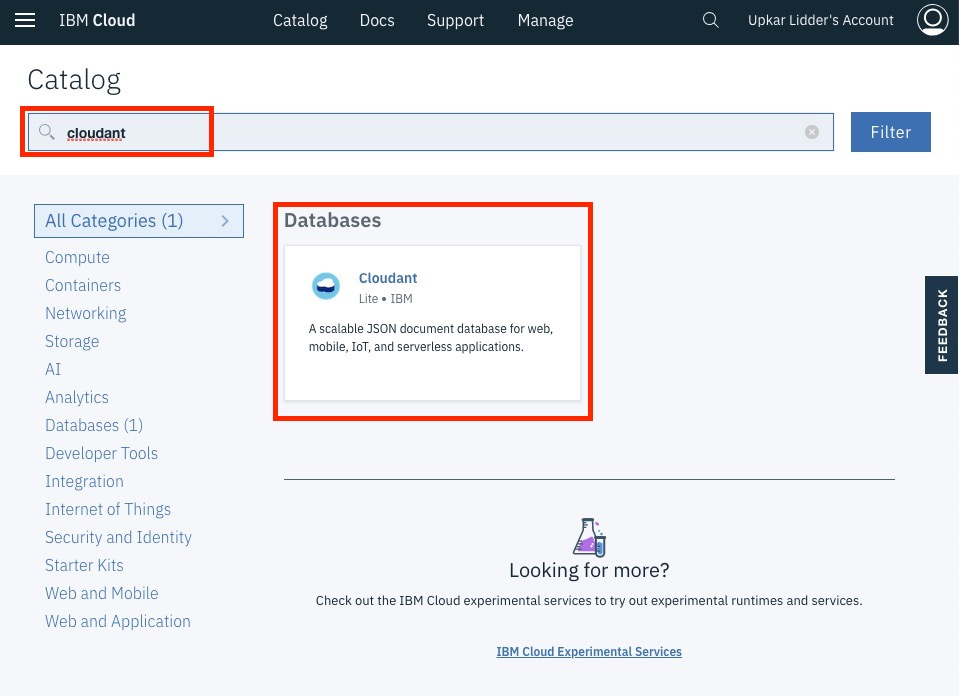

2.1.2 Create an instance and fill out the information as below

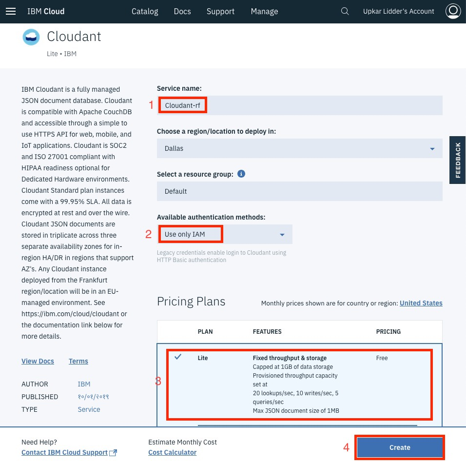

2.2 Alternatively, you can create a Cloudant service using the CLI as follows
```
ibmcloud resource service-instance-create <Cloudant-rf> cloudantnosqldb lite us-south
```
`Cloudant-rf` is the name of my instance of Cloudant.

You can now create authentication key for this new service you just created. This step is optional if you created the Cloudant service using the dashboard.

```
ic resource service-key-create cloudantnosqldb Manager --instance-name Cloudant-rf
```

Once you have created Cloudant Instance, create a `testdb` database. The name is important as we will use it to bind our trigger later.

2.3 You should see the instance in your dashboard.

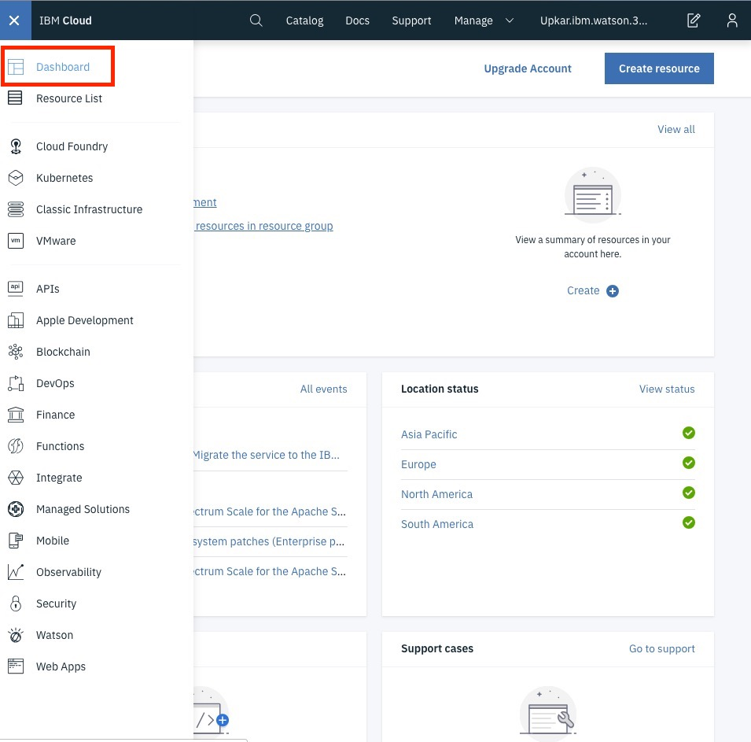

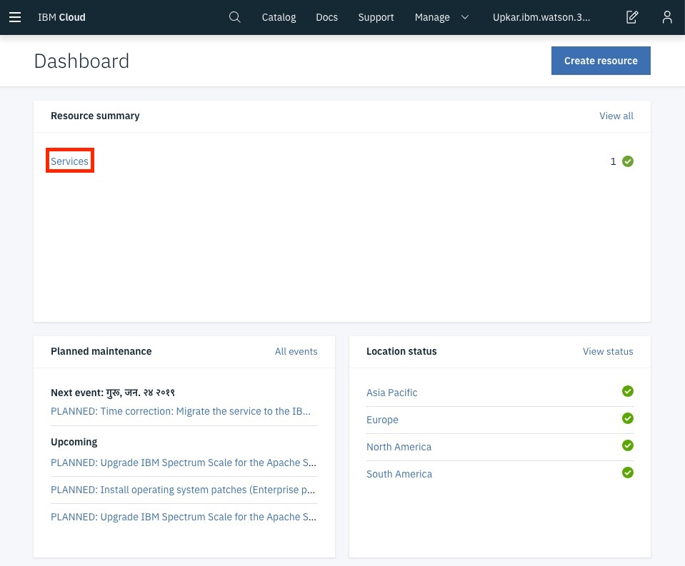

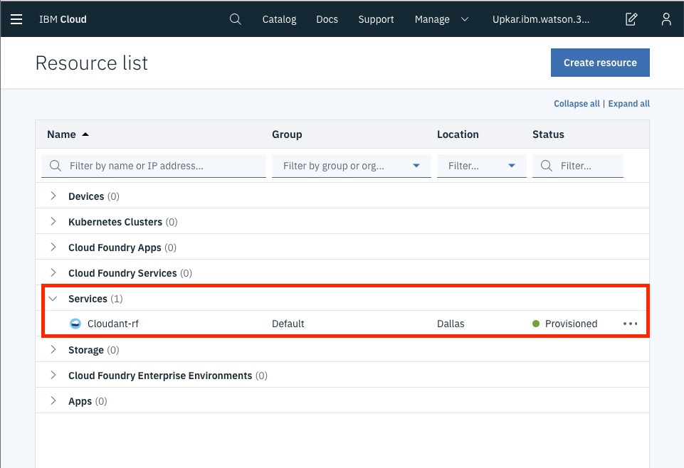

2.4 Click on the instance to launch the home page

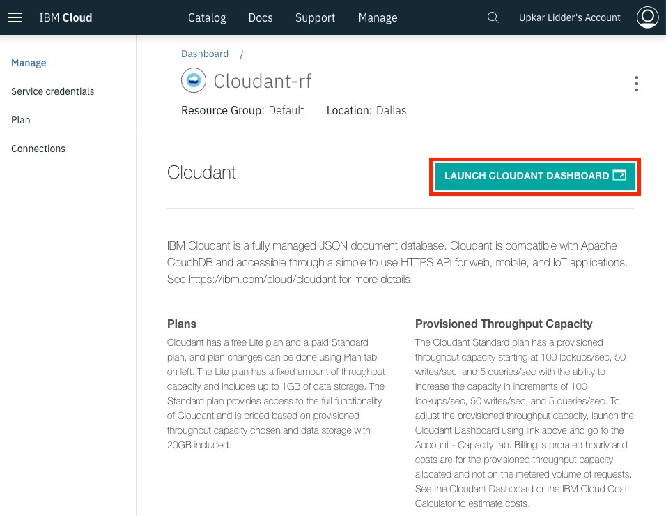

2.5 Launch the Cloudant database and click on `Create Database`.

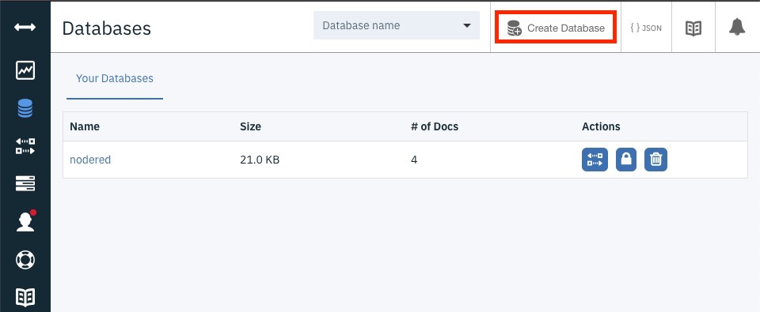

2.6 Create a new database called `testdb`. You don't need to add any documents in this database at this point.

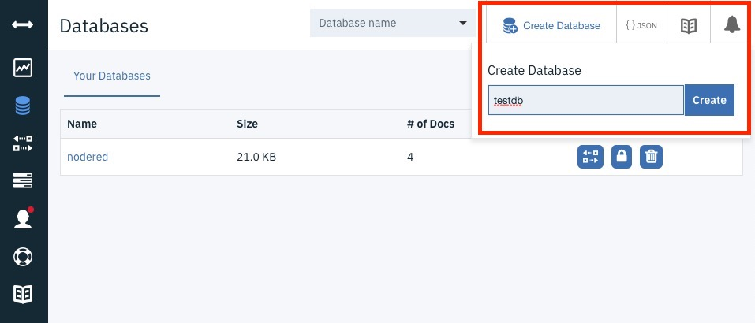
## 3. Create OpenWhisk Components

3.1 Bind whisk.system/cloudant to your namespace resulting in a new package
```
ic fn package bind /whisk.system/cloudant upkar-cloudant-package
``` 
3.2 If you now list package and do a get on `upkar-cloudant-package`, you will see all the actions and feeds available are the same as those on `/whisk.system/cloudant`. 

3.3 Bind the Cloudant service instance with this new package, so you can use the credentials without explicitly storing them as default parameters.
```
ic fn service bind cloudantnosqldb upkar-cloudant-package --instance Cloudant-rf
```

3.4  Create a package which will hold all your actions
```
ic fn package create forwardjs-dev
```

### Create and test send_email action

3.5 Create an account on [SendGrid](https://sendgrid.com/) and obtain your API key. We will use it in a couple of steps.

3.6 Create `send_email` action inside `forwardjs-dev` package.
```
cd javascript/sendemail/
npm install
zip -r sendmail.zip .
ic fn action create forwardjs-dev/send_email --kind nodejs:default sendmail.zip
```

3.7 Set the SendGrid API key as the default parameter
```
ic fn action update forwardjs-dev/send_email -p sendgrid_token <token from step above>
```

3.8 Invoke `send_email` action to test it out
```
ic fn action invoke forwardjs-dev/send_email -r -p user_email <"your_email_address@domain">
```
You should see a new email in your email address passed in as `user_email`.

For example
```
ic fn action invoke forwardjs-dev/send_email -r -p user_email "upkar.ibm.watson@gmail.com"
{
    "status": "OK"
}
```

### Create and test send_sms action

3.9 Create an account on [Twilio](https://www.twilio.com/try-twilio) and obtain your `accountSId` and the `authToken`. We will use them in a couple of steps. Also create a twilio trial phone number, which will be used to send the text message.

3.10 Create `send_sms` action inside `forwardjs-dev` package.
```
cd javascript/sendsms/
npm install
zip -r sendsms.zip .
ic fn action create forwardjs-dev/send_sms --kind nodejs:default sendsms.zip
```

3.11 Set the Twilio `accountSId`, `authToken` and `twilio_phone ` as the default parameters
```
ic fn action update forwardjs-dev/send_sms -p twilio_phone "<your twilio phone>" -p accountSid "<your twilio account SID>" -p authToken "<your twilio authToken>"

```

3.12 Invoke `send_sms` action to test it out
```
ic fn action invoke forwardjs-dev/send_sms -r -p user_phone "+1xxxyyyzzzz"
```
You should see a text message on your phone passed in as `user_phone`. If you don't, please ensure that

- the same numbers is added as a verified number in your Twilio account. You can only send sms to verified numbers using the free account.
- ensure the `user_phone` is in [E.164 format](https://www.twilio.com/docs/glossary/what-e164).


### Create triggers and rules for `send_email` and `send_sms` actions

3.13 Create two triggers

First for `send_email` action.
```
ic fn trigger create new_user_email_trigger
```
Second for `send_sms` action.
```
ic fn trigger create new_user_sms_trigger
```

3.14 Create two rules linking email and sms triggers with their corresponding actions

First for `new_user_email_trigger` and `send_email`
```
ic fn rule create new_user_email_rule new_user_email_trigger forwardjs-dev/send_email
```

Second for `new_user_sms_trigger` and `send_sms`
```
ic fn rule create new_user_sms_rule new_user_sms_trigger forwardjs-dev/send_sms
```

3.15 Let's test these out now.

Test sending sms using the trigger
```
ic fn trigger fire new_user_email_trigger -p user_email "upkar.ibm.watson@gmail.com"
```

Test sending email using the trigger
```
ic fn trigger fire new_user_sms_trigger -p user_phone "+1xxxyyyzzzz"
```
You should see a text message on your phone passed in as `user_phone`. If you don't, please ensure that

- the same numbers is added as a verified number in your Twilio account. You can only send sms to verified numbers using the free account.
- ensure the `user_phone` is in [E.164 format](https://www.twilio.com/docs/glossary/what-e164).

### Create the `forwardjs-dev/userchangeseq` action that will get triggered when the cloudant database changes
The `forwardjs-dev/userchangeseq` is composed of two actions

- `upkar-cloudant-package/read`: this is provided by `whisk.system/cloudant` and simply passes the document that was changed (added, deleted or edited) to the next action.
- `forwardjs-dev/notifyuser`: this action checks for the `args.user_email` and `args.user_phone` and fires the appropriate trigger to send an email or sms.

3.16 We had created the package `upkar-cloudant-package` by binding the `whisk.system/cloudant` package, so the `read` action is available for free.

3.17 Create the `notifyuser` action

```
cd javascript/userchanges/
ic fn action create forwardjs-dev/notifyuser index.js
```

3.18 Create the action sequence from the above two actions
```
ic fn action create forwardjs-dev/userchangeseq --sequence upkar-cloudant-package/read,forwardjs-dev/notifyuser
```

3.19 Create the trigger that will listen on the Cloudant changes using the `upkar-cloudant-package/changes` feed
```
ic fn trigger create user_changes_trigger --feed upkar-cloudant-package/changes --param dbname testdb
```
3.20 Create the rule that links the action sequence `forwardjs-dev/userchangeseq` to the cloudant `changes` feed from the `upkar-cloudant-package/changes` feed.
```
ic fn rule create upkar-cloudant-changed_rule user_changes_trigger forwardjs-dev/userchangeseq
```

3.21 Finally, lets test the application by triggering the `user_changes_trigger`. The problem is that the `upkar-cloudant-package/read` action will need a document as an input. So we cannot simply invoke the trigger using the CLI. Instead, go to [IBMCloud Dashboard](https://console.bluemix.net/dashboard/apps) and look for the cloudant instance you created earlier.

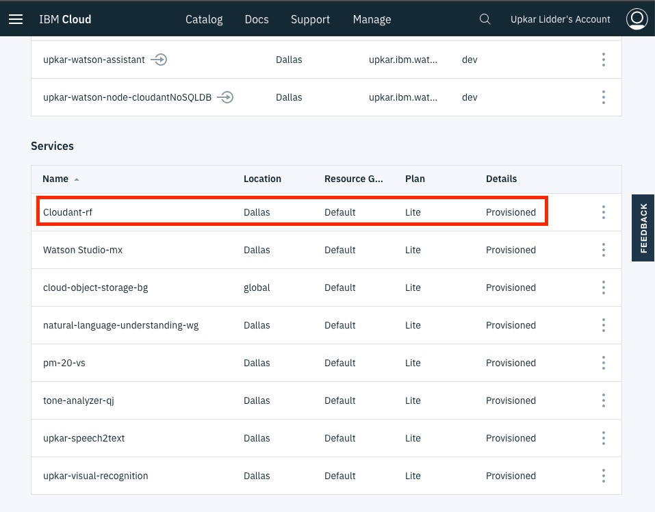

Launch the `testdb` database

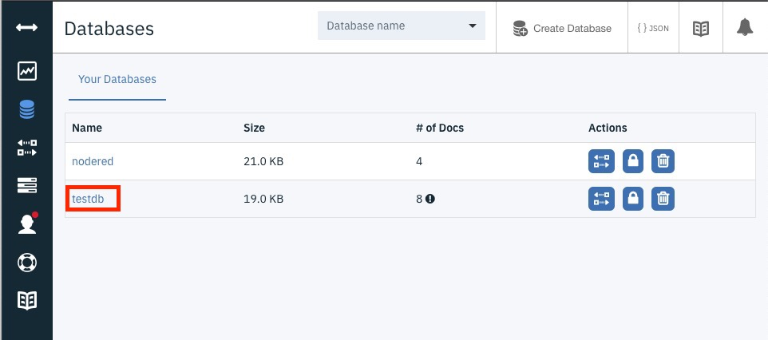

Create a new Document

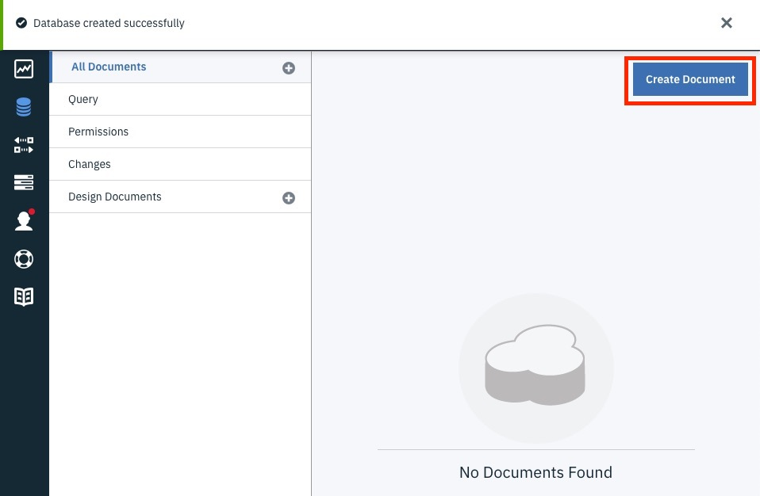

Add values for `user_email` and `user_phone`

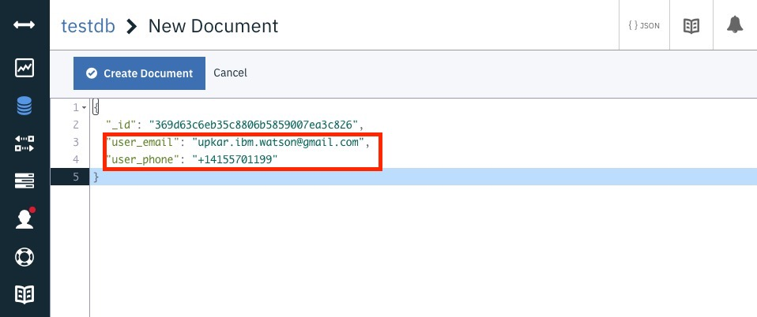


You should get an email and a text message on your phone passed in as `user_phone`. If you don't, please ensure that

- the same numbers is added as a verified number in your Twilio account. You can only send sms to verified numbers using the free account.
- ensure the `user_phone` is in [E.164 format](https://www.twilio.com/docs/glossary/what-e164).

Before testing, you can also tail the OpenWhisk logs by using `ic activation poll`.
